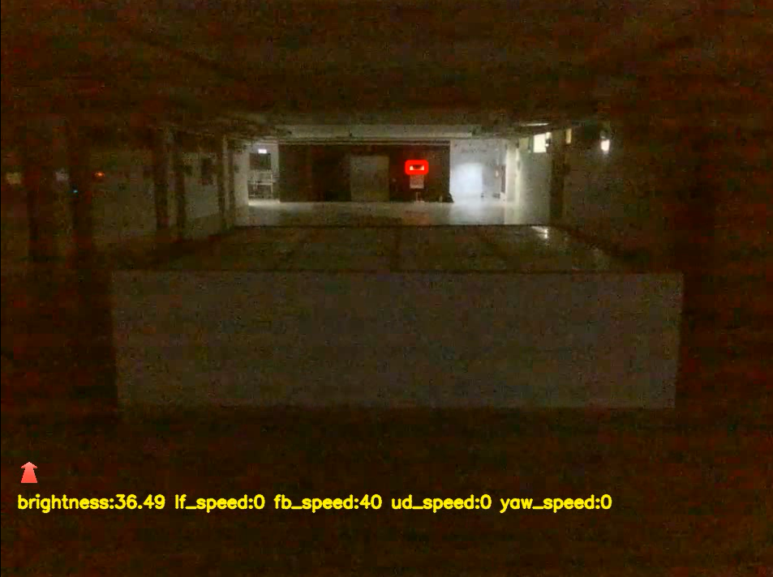
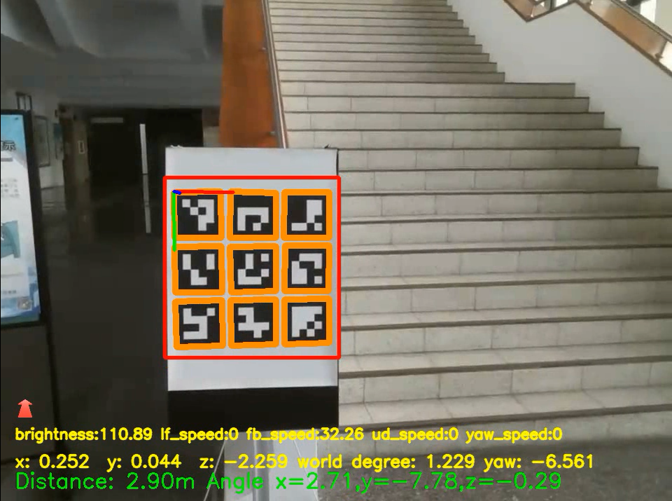

# Tello_Aruco
UVA aruco and opencv controller

## setting
* python 3.8
* pytorch-1.0
  
### data preparation
* training data: [data/<training_dataset>](https://github.com/sgcob187575/ArUcoBeacon)https://github.com/sgcob187575/ArUcoBeacon
* pretrained model: best/best.pt
## demo

### object
* Beacon

* ArUco Board

