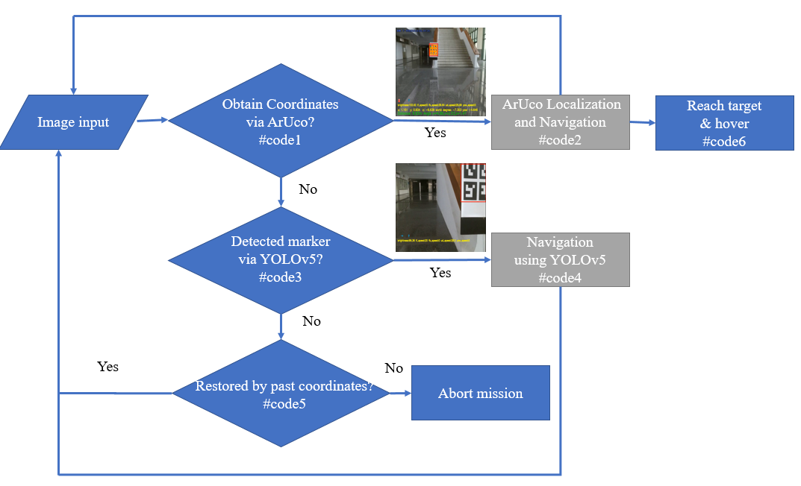
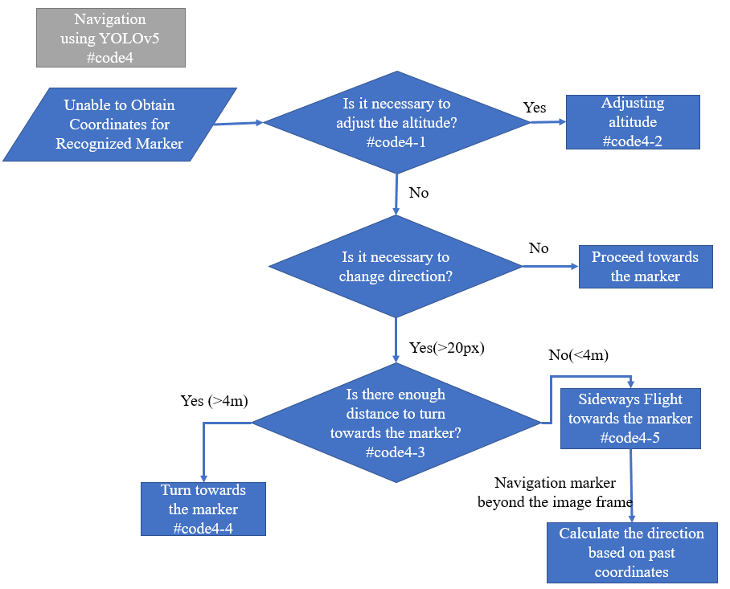

# Tello_Aruco
Drone Positioning in GPS-less Environment Using Fiducial Marker and Multi-Intensity Illuminator

## Setting
* python 3.8
* pytorch
* opencv-python==4.6.0.66
* opencv-contrib-python==4.6.0.66

### data preparation
* training data: [datasets/<training_dataset>](https://github.com/sgcob187575/ArUcoBeacon)
* pretrained model: best/best.pt
### installation guide
* conda create -- name Tello_Aruco python=3.8
* conda activate Tello_Aruco
* pip install opencv-python==4.6.0.66
* pip install opencv-contrib-python==4.6.0.66
* pip install djitellopy
* conda install pytorch torchvision torchaudio pytorch-cuda=VERSION -c pytorch -c nvidia
## Demo

### Detection
* Navigation using YOLOv5

* ArUco Localization and Navigation

## Algorithm

### Drone Guidance Algorithm

### ArUco Localization and Navigation

### Navigation using YOLOv5

